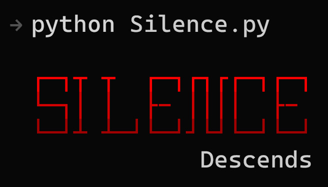

# Silence

Silence is an open source, cross platform framework designed to help organizations of all sizes practice security testing. Its primary purpose is to stage and manage reverse shells. This makes it a very important tool for pentesters and offsec practicers.

The service as a whole, is fully operational on both Windows and Linux. 

[](https://www.python.org/)

[](https://github.com/SilentisVox/Silence/blob/master/LICENSE)


### Features

- Interactive CLI
- Argument Parsing for Configuration
- TCP Reverse-Shell Handler
- HTTP Stager
- Payload Generation
- Session Management Commands
- Service Control Commands
- Utility Commands
- Core Client-Side Payload
- Colorized Output and Formatting

### Setup

```
git clone https://github.com/SilentisVox/Silence
cd Silence
python3 Silence.py
```

### Usage

```
python3 Silence.py [-h] -c [callback_address] -l [handler_port] -p [stager_port]
```

### Demo

<p align="center">
  <sup>Video Demo on YouTube</sup>
  <br>
  <a href="https://youtu.be/iiUF09fTu5w">
    
  </a>
</p>


### Example

```
 → python Silence.py -h

usage: Silence.py [-h] [-c C] [-p P] [-l L]

options:
  -h, --help  show this help message and exit
  -c C        Callback address
  -p P        TCP Handler port (Default 4443)
  -l L        HTTP Stager port (Default 8080)
```

```
Silence> help

 Command       Description
 ------------  ---------------------------------------------

 shell    [+]  Begins communication with a specified client.
 sessions      Displays current sessions avaialable.
 generate      Generates a 1-stop-shop payload that creates
               a reverse shell with the current settings.
 jobs          Displays current services running.
 start    [+]  Starts a given service [handler|listener],
               with given args [callback_ip|callback_port]
 stop     [+]  Stops a given service [handler|listener].
 kill     [+]  Kills a connection with a specified client.
 help          Displays this menu.
 clear         Clears the terminal window.
 exit          Exits Silence.
```